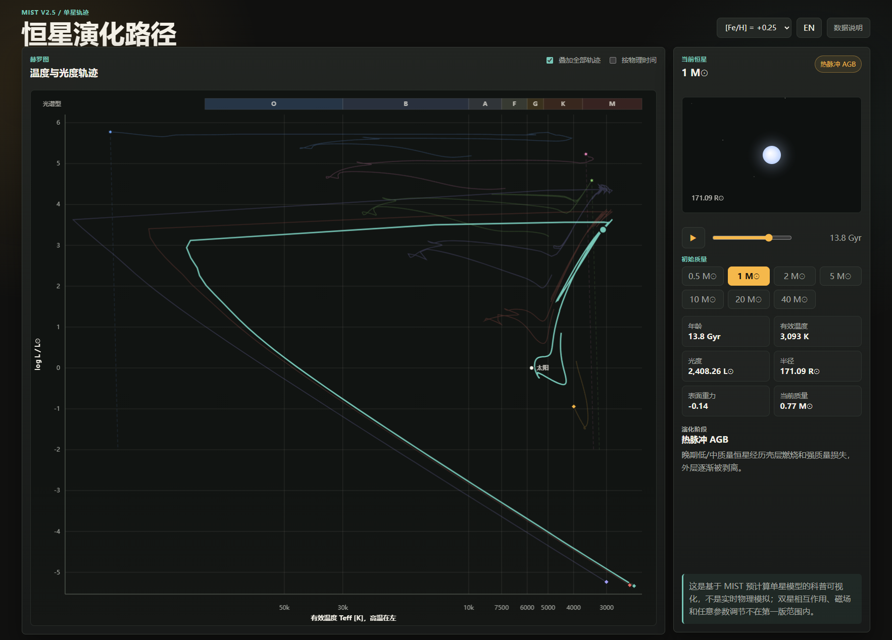

<div align="center">
  <h1>Stellara</h1>
  <h3>交互式恒星演化可视化 · 从主序到终焉</h3>

  <p>
    中文 | <a href="README_EN.md">English</a>
  </p>

<p>
  <b>从氢核点燃的第一缕光，到白矮星的余温或超新星的绝响。</b><br>
  跨越百亿年的恒星命运，尽在 HR 图上展开。
</p>

<h3>
  <a href="https://seanwong17.github.io/Stellara/">在线体验 (Live Demo)</a>
</h3>

<p>
    
    
    
    
</p>
</div>

---

## 简介

**Stellara** 是一个运行于现代浏览器的恒星演化交互式可视化工具。基于 MIST v2.5（MESA Isochrones and Stellar Tracks）预计算轨迹数据，将不同初始质量、不同金属丰度恒星的完整生命历程呈现在赫罗图（HR Diagram）上。

不同于静态教科书插图，Stellara 让你：
- 亲眼看到一颗太阳质量恒星如何在主序上度过 90% 的生命
- 对比 0.5 M☉ 红矮星与 40 M☉ 蓝巨星截然不同的演化命运
- 理解金属丰度如何影响恒星的温度、光度和寿命

## 核心特性

### 赫罗图 (HR Diagram)
- **Canvas 2D 双层渲染**：静态层绘制坐标轴、轨迹线、光谱带；动态层仅更新当前点，保证动画流畅
- **光谱分类带**：O / B / A / F / G / K / M 型标注
- **终态标记**：白矮星（菱形）、核坍缩（星爆）、超新星坍缩虚线
- **触摸交互**：点击查看数据点 tooltip，双指缩放

### 恒星生命周期
- **动画播放**：从主序前到白矮星/核坍缩的完整演化过程
- **物理时间模式**：开启后滑块按真实年龄比例映射，直观感受时间尺度差异
- **阶段识别**：主序前、主序、亚巨星/红巨星、红巨星顶端、核心氦燃烧、TP-AGB、白矮星、Wolf-Rayet 等
- **阶段转换反馈**：进入新阶段时 UI 脉冲 + 恒星闪光

### 恒星可视化
- **实时渲染**：颜色、半径、辉光随温度和光度变化
- **表面结构**：对流带纹理跟随演化阶段变化
- **终态渲染**：白矮星（小而白热）/ 超新星壳层扩散

### 数据与科学
- **三组金属丰度**：[Fe/H] = 0.00（太阳）、−1.00（贫金属）、+0.25（富金属）
- **七条质量轨迹**：0.5, 1, 2, 5, 10, 20, 40 M☉
- **Wolf-Rayet 识别**：大质量恒星质量损失 >40% 且高温时自动标记

### 技术特性
- **零构建依赖**：纯 Vanilla JS ES Modules，无需 bundler
- **中英双语**：一键切换界面语言
- **响应式设计**：桌面端与移动端自适应
- **列式 JSON**：数据体积比行式减少 ~50%

## 预览

<p align="center">
  
</p>

<h3>
  <a href="https://seanwong17.github.io/Stellara/">👉 点击进入在线体验 (Live Demo) 👈</a>
</h3>

## 技术栈

* **Core**: HTML5, CSS3, JavaScript (ES Modules)
* **Rendering**: Canvas 2D (HR 图 + 恒星可视化)
* **Data**: MIST v2.5 precomputed EEP tracks
* **Font**: Inter (system fallback)

## 目录结构

```text
stellara/
├── index.html              # 入口
├── src/js/
│   ├── app.js              # 初始化与事件编排
│   ├── state.js            # 共享状态与派生计算
│   ├── utils.js            # 数学、格式化、插值
│   ├── hr-chart.js         # Canvas HR 图（双层架构）
│   ├── star-renderer.js    # Canvas 恒星可视化
│   ├── animation.js        # 播放引擎
│   └── i18n.js             # 双语文本
├── src/css/styles.css      # 样式
├── data/tracks/            # MIST 轨迹子集（列式 JSON）
│   ├── feh_p000/           # 太阳金属丰度
│   ├── feh_m100/           # 贫金属
│   └── feh_p025/           # 富金属
├── scripts/                # 数据生成工具
│   └── build_mist_subset.py
├── docs/                   # 科学文档
└── assets/                 # 图标
```

## 本地运行

```bash
# Clone
git clone https://github.com/SeanWong17/Stellara.git
cd Stellara

# 启动本地服务器
python3 -m http.server 8000
```

访问 http://localhost:8000

> 不要直接打开 `index.html`，浏览器会阻止 `fetch()` 加载本地 JSON。

## 数据再生成

如需重新生成或扩展数据：

```bash
# 太阳金属丰度
python3 scripts/build_mist_subset.py --feh 0.00 --download

# 贫金属
python3 scripts/build_mist_subset.py --feh "-1.00" --download

# 富金属
python3 scripts/build_mist_subset.py --feh "+0.25" --download
```

支持 MIST 发布的所有金属丰度值（[Fe/H] 从 −4.00 到 +0.50）。

## 科学边界

本项目是面向公众理解恒星演化的可视化工具，**不是**实时恒星结构模拟器。

| 包含 | 不包含 |
|---|---|
| 单星从 PMS 到终态的完整演化 | 双星相互作用、合并 |
| 低质量→白矮星冷却序列 | 磁场效应 |
| 高质量→碳燃烧（模型终点） | 实际超新星光变曲线 |
| Wolf-Rayet 阶段识别 | 任意旋转参数 |
| HR 图坍缩虚线（示意） | 在线 MESA 计算 |

## 参考文献

- Choi, J. et al. (2016). *MESA Isochrones and Stellar Tracks (MIST). I.* ApJ, 823, 102
- Paxton, B. et al. (2011). *Modules for Experiments in Stellar Astrophysics (MESA).* ApJS, 192, 3
- Dotter, A. (2016). *MESA Isochrones and Stellar Tracks (MIST). 0.* ApJS, 222, 8

## 开源协议

本项目代码使用 [MIT License](LICENSE) 开源。MIST 数据使用请遵循 MIST 项目引用要求。

---

<div align="center">
  <sub>Designed with ❤️ by Sean Wong</sub>
</div>
